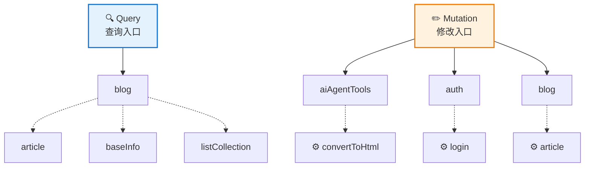

# NamBlog GraphQL API 接口规范（自动生成）

> 生成时间: 2026-01-01 20:58:30
> GraphQL 端点: http://localhost:5000/graphql

**主要端点**:
- **GraphQL**: `/graphql` (主接口)
- **GraphiQL 调试**: `/ui/graphiql`
- **Altair Client**: `/ui/altair`
- **Voyager 可视化**: `/ui/voyager`

## 📊 API 结构总览



---

## 🔍 Query（查询操作）

### `blog`

> 博客入口

**返回类型**: `BlogQuery`

**输入参数**: 无

**返回类型结构**:

```
BlogQuery {
  article: ArticleQuery
  baseInfo: BlogBasic
  listCollection: ListCollect
}
```

---


## ✏️ Mutation（修改操作）

### `auth`

> 认证入口（登录）

**返回类型**: `AuthMutation`

**输入参数**: 无

**返回类型结构**:

```
AuthMutation {
  login: LoginResult
}
```

---

### `blog`

> 博客入口（仅限管理员）

**返回类型**: `BlogMutation`

**输入参数**: 无

**返回类型结构**:

```
BlogMutation {
  article: ArticleMutation
}
```

---

### `aiAgentTools`

> AI智能体工具入口（仅限管理员）

**返回类型**: `AgentMutation`

**输入参数**: 无

**返回类型结构**:

```
AgentMutation {
  convertToHtml: HtmlConversionResult
}
```

---


## 📦 类型定义

### 📋 输出类型

### `AgentMutation`

> AI Agents操作

- **`convertToHtml`**: `HtmlConversionResult` - 将 Markdown 转换为 HTML（使用 AI 生成，用于预览效果）
  - **`markdown`**: `String!` - 要转换的 Markdown 文本
  - **`customPrompt`**: `String` - 可选的自定义提示词，可调整样式


### `ArticleDetail`

> 文章详情

- **`id`**: `Int!` - 文章ID
- **`title`**: `String!` - 标题
- **`slug`**: `String!` - URL标识
- **`author`**: `String!` - 作者
- **`excerpt`**: `String!` - 摘要
- **`category`**: `String!` - 分类
- **`tags`**: `[String!]!` - 标签数组
- **`aiPrompts`**: `[String!]!` - AI 提示词历史
- **`isPublished`**: `Boolean!` - 是否已发布
- **`isFeatured`**: `Boolean!` - 是否为精选
- **`publishedAt`**: `DateTimeOffset` - 发布时间
- **`createTime`**: `DateTimeOffset!` - 创建时间
- **`lastModified`**: `DateTimeOffset!` - 最后修改时间
- **`versions`**: `[ArticleVersion]` - 版本列表
- **`mainVersion`**: `ArticleVersion` - 当前发布的主版本
- **`markdown`**: `String` - Markdown 源文件（仅管理员可见，按需查询）
- **`mainVersionHtml`**: `String` - 主版本 HTML 内容（按需查询，已发布文章公开可见）


### `ArticleListItem`

> 文章列表项

- **`id`**: `Int!` - 文章ID
- **`title`**: `String!` - 标题
- **`slug`**: `String!` - URL标识
- **`excerpt`**: `String!` - 摘要
- **`category`**: `String!` - 分类
- **`tags`**: `[String!]!` - 标签数组
- **`isPublished`**: `Boolean!` - 是否已发布
- **`isFeatured`**: `Boolean!` - 是否为精选
- **`publishedAt`**: `DateTimeOffset` - 发布时间
- **`lastModified`**: `DateTimeOffset!` - 最后修改时间


### `ArticleMetadata`

> 文章元数据（包含管理员编辑页所需的完整数据）

- **`postId`**: `Int!` - 文章ID
- **`title`**: `String` - 标题
- **`slug`**: `String` - URL标识
- **`excerpt`**: `String` - 摘要
- **`category`**: `String!` - 分类
- **`tags`**: `[String]` - 标签
- **`allCategories`**: `[CategoryStatistic]` - 所有分类列表（含统计）
- **`allTags`**: `[TagStatistic]` - 所有标签列表（含统计）
- **`aiPrompts`**: `[String!]!` - AI提示词历史
- **`versionNames`**: `[String!]!` - 版本名称列表
- **`mainVersion`**: `MainVersionDetail` - 主版本详细信息
- **`isPublished`**: `Boolean!` - 是否已发布
- **`isFeatured`**: `Boolean!` - 是否为精选
- **`createTime`**: `DateTimeOffset!` - 创建时间
- **`lastModified`**: `DateTimeOffset!` - 最后修改时间


### `ArticleMutation`

> 文章变更操作

- **`saveArticle`**: `ArticleMetadata` - 保存文章（创建时生成HTML版本，更新时不生成版本，需要管理员权限）
  - **`input`**: `SaveArticleInput!` - 保存文章参数
- **`submitArticle`**: `ArticleVersionSubmit` - 提交文章（生成HTML并创建版本，支持用户提供HTML或AI生成，需要管理员权限）
  - **`input`**: `SubmitArticleInput!` - 提交文章参数
- **`deleteVersion`**: `Boolean` - 删除指定版本（如果是最后一个版本则删除整篇文章，需要管理员权限）
  - **`id`**: `Int!` - 文章ID
  - **`versionName`**: `String!` - 版本名
- **`togglePublish`**: `ArticleDetail` - 切换文章发布状态（需要管理员权限）
  - **`id`**: `Int!` - 文章ID
- **`deleteArticle`**: `Boolean` - 删除文章（包括所有版本，需要管理员权限）
  - **`id`**: `Int!` - 文章ID


### `ArticleQuery`

> 文章查询操作

- **`articles`**: `PagedArticleListItemResult` - 分页查询文章列表（支持发布状态、分类、标签、精选过滤）
  - **`page`**: `Int` - 页码（从1开始，默认1）
  - **`pageSize`**: `Int` - 每页大小（默认10，最大100）
  - **`isPublished`**: `Boolean` - 是否已发布（管理员可选，游客固定为已发布）
  - **`isFeatured`**: `Boolean` - 是否为精选文章（不传则返回全部）
  - **`category`**: `String` - 按分类过滤（精确匹配）
  - **`tags`**: `[String]` - 按标签过滤（包含任意一个标签即可）
- **`article`**: `ArticleDetail` - 获取文章详情（支持指定版本，非主版本需要管理员权限）
  - **`slug`**: `String!` - 文章 slug
  - **`versionName`**: `String` - 版本名称（可选，默认返回主版本）
- **`getVersionHtml`**: `String` - 获取指定版本的HTML内容（用于版本预览，不修改数据库）
  - **`id`**: `Int!` - 文章ID
  - **`versionName`**: `String!` - 版本名称
- **`getArticleMarkdown`**: `String` - 获取文章的 Markdown 源文件（仅管理员，至少提供一个参数：slug、id 或 title）
  - **`slug`**: `String` - 文章 slug（可选）
  - **`id`**: `Int` - 文章 id（可选）
  - **`title`**: `String` - 文章标题（可选，模糊匹配）


### `ArticleVersion`

> 文章版本

- **`versionId`**: `Int!` - 版本ID
- **`versionName`**: `String!` - 版本名称
- **`aiPrompt`**: `String` - AI 提示词
- **`validationStatus`**: `HtmlValidationStatus!` - HTML 验证状态
- **`validationError`**: `String` - 验证错误信息
- **`createdAt`**: `DateTimeOffset!` - 创建时间


### `ArticleVersionSubmit`

> 文章版本提交结果

- **`slug`**: `String!` - 文章 Slug（用于前端跳转）


### `AuthMutation`

> 认证相关操作

- **`login`**: `LoginResult` - 管理员登录，返回登录结果
  - **`username`**: `String!` - 用户名
  - **`password`**: `String!` - 密码


### `BlogBasic`

> 博客基本信息查询

- **`blogName`**: `String` - 博客名
- **`blogger`**: `String` - 博主名
- **`icon`**: `String` - 网站图标
- **`avatar`**: `String` - 博客头像
- **`slogan`**: `String` - 博客简介
- **`outerChains`**: `[OuterChain]` - 博客外链（名称、链接、SVG


### `BlogMutation`

> 博客变更入口

- **`article`**: `ArticleMutation` - 文章变更入口


### `BlogQuery`

> 博客查询操作

- **`article`**: `ArticleQuery` - 文章查询入口
- **`baseInfo`**: `BlogBasic` - 博客基本信息
- **`listCollection`**: `ListCollect` - 标签/专栏列表及相应文章数量的统计
  - **`category`**: `String` - 专栏名
  - **`tags`**: `[String]` - 标签集合


### `CategoryStatistic`

> 分类统计信息

- **`name`**: `String!` - 分类名称
- **`count`**: `Int!` - 文章数量


### `HtmlConversionResult`

> HTML 转换结果

- **`status`**: `HtmlConversionStatus!` - 转换状态
- **`html`**: `String!` - 生成的 HTML 内容
- **`error`**: `String` - 错误信息（仅在失败时有值）


### `ListCollect`

> 数量统计相关查询

- **`tags`**: `[TagStatistic]` - 标签列表及相应文章数量统计（按数量-名称排序）
- **`categorys`**: `[CategoryStatistic]` - 分类列表及相应文章数量统计（按数量-名称排序）


### `LoginResult`

> 登录结果

- **`success`**: `Boolean!` - 是否成功
- **`token`**: `String` - JWT Token（成功时返回）
- **`message`**: `String` - 错误消息（失败时返回）
- **`errorCode`**: `String` - 错误代码


### `MainVersionDetail`

> 主版本详细信息

- **`versionName`**: `String!` - 版本名称
- **`html`**: `String!` - HTML内容
- **`validationStatus`**: `HtmlValidationStatus!` - HTML验证状态
- **`htmlValidationError`**: `String` - HTML验证错误信息


### `OuterChain`

> 博客外链查询

- **`name`**: `String` - 外链名称
- **`link`**: `String` - 外链地址
- **`svg`**: `String` - 外链图标


### `PagedArticleListItemResult`

> 分页文章列表结果

- **`items`**: `[ArticleListItem]` - 当前页的文章列表
- **`pageInfo`**: `PageInfo` - 分页信息


### `PageInfo`

> 分页信息

- **`currentPage`**: `Int!` - 当前页码
- **`pageSize`**: `Int!` - 每页大小
- **`totalCount`**: `Int!` - 总记录数
- **`totalPages`**: `Int!` - 总页数
- **`hasPreviousPage`**: `Boolean!` - 是否有上一页
- **`hasNextPage`**: `Boolean!` - 是否有下一页


### `TagStatistic`

> 标签统计信息

- **`name`**: `String!` - 标签名称
- **`count`**: `Int!` - 文章数量


### 📥 输入类型

### `SaveArticleInput`

> 保存文章输入参数（创建时生成HTML版本，更新时不生成版本）

- **`markdown`**: `String!` - Markdown 内容（必填）
- **`id`**: `Int` - 文章ID（null表示创建新文章，否则更新现有文章）
- **`title`**: `String` - 文章标题（可选，未提供时AI自动生成）
- **`slug`**: `String` - URL标识（可选，未提供时AI自动生成）
- **`category`**: `String` - 分类（可选，默认"未分类"）
- **`tags`**: `[String]` - 标签数组（可选，未提供时AI自动生成）
- **`excerpt`**: `String` - 摘要（可选，未提供时AI自动生成）
- **`isFeatured`**: `Boolean` - 是否为精选文章（可选）
- **`isPublished`**: `Boolean` - 是否发布（可选）
- **`mainVersion`**: `String` - HTML主版本（可选）
- **`customPrompt`**: `String` - 自定义AI提示词（可选）


### `SubmitArticleInput`

> 提交文章输入参数（生成新版本HTML并设置为主版本，支持用户提供HTML或AI生成）

- **`markdown`**: `String!` - Markdown 内容（必填）
- **`id`**: `Int` - 文章ID（null表示创建新文章，否则为现有文章创建新版本）
- **`html`**: `String` - HTML 内容（可选，未提供时AI生成）
- **`title`**: `String` - 文章标题（可选，未提供时AI自动生成）
- **`slug`**: `String` - URL标识（可选，未提供时AI自动生成）
- **`category`**: `String` - 分类（可选，默认"未分类"）
- **`tags`**: `[String]` - 标签数组（可选，未提供时AI自动生成）
- **`excerpt`**: `String` - 摘要（可选，未提供时AI自动生成）
- **`isFeatured`**: `Boolean` - 是否为精选文章（可选）
- **`isPublished`**: `Boolean` - 是否发布（可选）
- **`customPrompt`**: `String` - 自定义AI提示词（可选）


### 🏷️ 枚举类型

### `HtmlConversionStatus`

- **`GENERATING`**
- **`COMPLETED`**
- **`FAILED`**


### `HtmlValidationStatus`

- **`NOT_VALIDATED`**
- **`VALID`**
- **`INVALID`**


