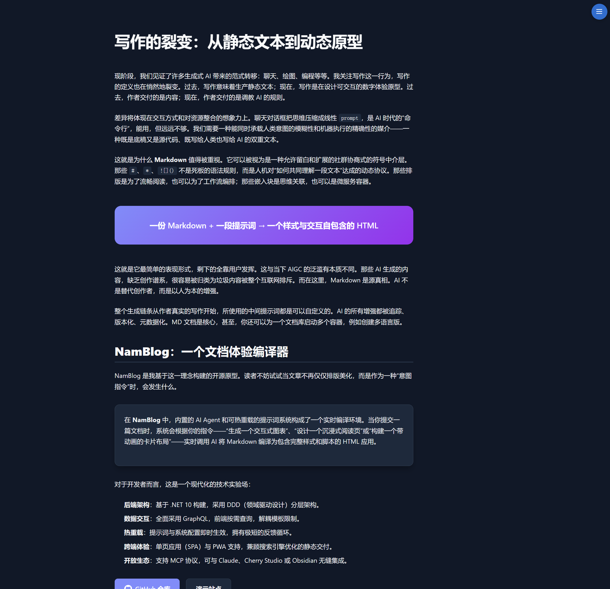

# NamBlog

> [中文版本](./README.zh.md) | English Version

A blog system dedicated to enhancing content presentation. Write freely and let AI generate pages.

[](LICENSE.txt)
[](https://github.com/code-gal/namblog/releases)
[](https://github.com/code-gal/namblog/actions)
[](https://www.docker.com/)
[](https://github.com/code-gal/namblog/pkgs/container/namblog)

## Core Features

### Markdown + AI = Rich Web Applications

Focus only on content when writing your blog. Treat Markdown as a blueprint, and let AI agents transform it into HTML pages with styles and interactions. Beyond just beautiful typography, AI can generate various web applications based on your prompts—animated presentation pages, interactive charts, code demonstrations, card layouts, and more. You can switch between different versions at any time to unleash your creativity.

### Management Approaches

**Web Editor**: The most feature-rich editing method. Supports AI pre-generation and rendering, common HTML error checking, automatic draft caching, history prompts, version history viewing, and more. Suitable for daily content creation and fine-grained management.

**MCP Protocol**: Integrate your blog with popular AI clients like Cherry Studio. Let AI automatically organize workflows in conversations—create articles, query data, batch modify tags. AI will automatically call blog tools to complete operations. Ideal for batch management and automation.

**Folder Monitoring**: Recommended for use with editors like Obsidian. Sync your document library to the monitoring directory. Files are automatically synced to the blog database after saving. Perfect for those who prefer local writing and knowledge management.

### Interface Preview

<p align="center">
  <a href="Docs-Tools/images/index.png"></a>
  <a href="Docs-Tools/images/page.png"></a>
</p>
<p align="center">
  <a href="Docs-Tools/images/edit(desktop).png"></a>
  <a href="Docs-Tools/images/edit(desktop-dark).png"></a>
</p>

<video width="630" height="300" src="https://github.com/user-attachments/assets/e6243594-44b8-454d-b1a0-e44b7a11640c" controls></video>

## Main Features

### Content Creation

- Markdown editor with live preview
- Let AI generate HTML when submitting articles, customize style with prompts
- Each submission creates a new version, preserving complete history
- Support draft status, preview without publishing

### Management

- Modify article metadata (title, category, tags) anytime
- View and switch version history, publish any historical version with one click
- Filter articles by category, tags, publish status
- Support lock and featured markers, convenient for highlighting specific content on homepage

### Display

- Responsive layout, works on both mobile and desktop
- Dark mode toggle
- Paginated article browsing
- Category and tag pages

### Internationalization Support

- **Bilingual Interface**: Built-in Chinese and English support
- **Auto Detection**: Automatically switches interface language based on browser language
- **Extensible**: Support custom language packs, easily add more languages
- See: [Language Configuration Guide](Docs-Tools/Language-Configuration.md)

### Modern Frontend Experience

- **PWA Support**: Installable as desktop app, supports offline access
- **SPA Architecture**: Single-page application based on Vue 3, smooth browsing without page refresh
- **SEO Optimization**: Automatically detects search engine crawlers, returns pre-rendered static HTML to ensure content is indexed

### Deployment & Extensions

- **Analytics Integration**: Support embedding third-party analytics scripts in footer (e.g., Umami, Google Analytics). See: [Analytics Configuration Guide](Docs-Tools/Analytics-Configuration.md)
- **Flexible Configuration**: Blog name, AI parameters, CORS, and other configurations support hot reload, some can be overridden via environment variables

## MCP Integration

### What is MCP

Model Context Protocol (MCP) is a communication protocol between AI tools and applications. Through MCP, you can directly operate your blog in AI clients like Claude Desktop.

### Configuration

**1. Configure AuthToken**

Set authentication token in `./data/config/config.json`:

```json
{
  "MCP": {
    "AuthToken": "your-secure-token"
  }
}
```

Or via Docker environment variable:
```bash
MCP__AuthToken="your-secure-token"
```

**2. Add NamBlog Server in MCP Client**

NamBlog supports two transport methods:

**Method 1: StreamableHttp** (Recommended)
```json
{
  "mcpServers": {
    "namblog": {
      "url": "https://your_domain/mcp",
      "transport": "streamableHttp",
      "headers": {
        "Authorization": "Bearer your-secure-token"
      }
    }
  }
}
```

**Method 2: SSE**
```json
{
  "mcpServers": {
    "namblog": {
      "url": "https://your_domain/mcp/sse",
      "transport": "sse",
      "headers": {
        "Authorization": "Bearer your-secure-token"
      }
    }
  }
}
```

After starting the MCP server, the client will automatically discover available Tools, Prompts, and Resources.

### MCP Supported Features

**Query Operations**:
- Query article list (with filtering by category, tags, publish status, etc.)
- Get article metadata (title, category, tags, version list, etc.)
- Get article Markdown source
- Get HTML content of specific version
- View blog basic information (blogger profile, external links, etc.)

**Management Operations**:
- Create new articles
- Update article metadata (title, category, tags, summary)
- Submit new version (generate HTML)
- Toggle publish status (publish/unpublish)
- Delete articles or versions

**AI Tools**:
- Markdown to HTML (for preview, not saved to database)

**Prompt Templates**:
- Article creation guidance (tells AI how to combine tools to complete creation workflow)
- Article optimization guidance (provides quality checklist)

**Resource Access**:
- Read resource files (backend static resources, prompt templates, etc.)


## Quick Start

### Using Docker Deployment (Recommended)

```bash

# Download docker-compose.yml
curl -O https://raw.githubusercontent.com/code-gal/NamBlog/main/docker-compose.yml

# Create config directory
mkdir -p data/config

# Download config template
curl -o data/config/config.json \
  https://raw.githubusercontent.com/code-gal/NamBlog/main/NamBlog.API/wwwroot/config/config.json.template

# Edit config file (configure AI API Key, etc.)
vi data/config/config.json

# Start service
docker-compose up -d
```

Visit http://localhost:5000 to start using.

### Docker Image Tags

| Tag | Description | Use Case |
|------|------|---------|
| `stable` | Stable release (recommended) | Production |
| `latest` | Latest release | Development |
| `1` | Major version (e.g., 1.x.x) | Testing |
| `0.8.0` | Specific version | Version pinning |

```bash
# Recommended for production
docker pull ghcr.io/code-gal/namblog:stable

# Development environment
docker pull ghcr.io/code-gal/namblog:latest

# Pin to specific version
docker pull ghcr.io/code-gal/namblog:0.8.0
```

Detailed configuration reference: [Config Template](NamBlog.API/wwwroot/config/config.json.template) | [Configuration Guide](Docs-Tools/Configuration-Guide.md)

### Local Development

Requires .NET 10 SDK.

```bash
# Clone repository
git clone https://github.com/code-gal/namblog.git
cd namblog

# Start backend
cd NamBlog.API
# Configure AI API Key (edit appsettings.Development.json)
dotnet run

# Start frontend (new terminal)
cd NamBlog.Web
# Use any HTTP server
python -m http.server 8080
```

**Developer Documentation**: Release Guide | Development Guide (Chinese only)

**Tech Stack**: .NET + GraphQL + EF Core + Vue 3 + Docker
