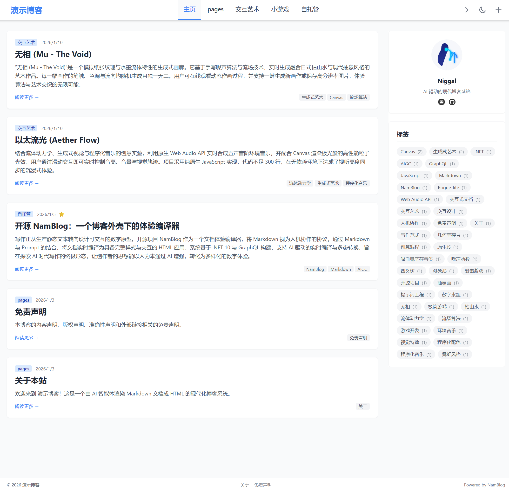
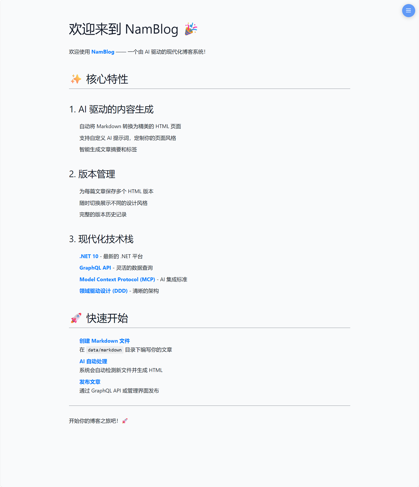
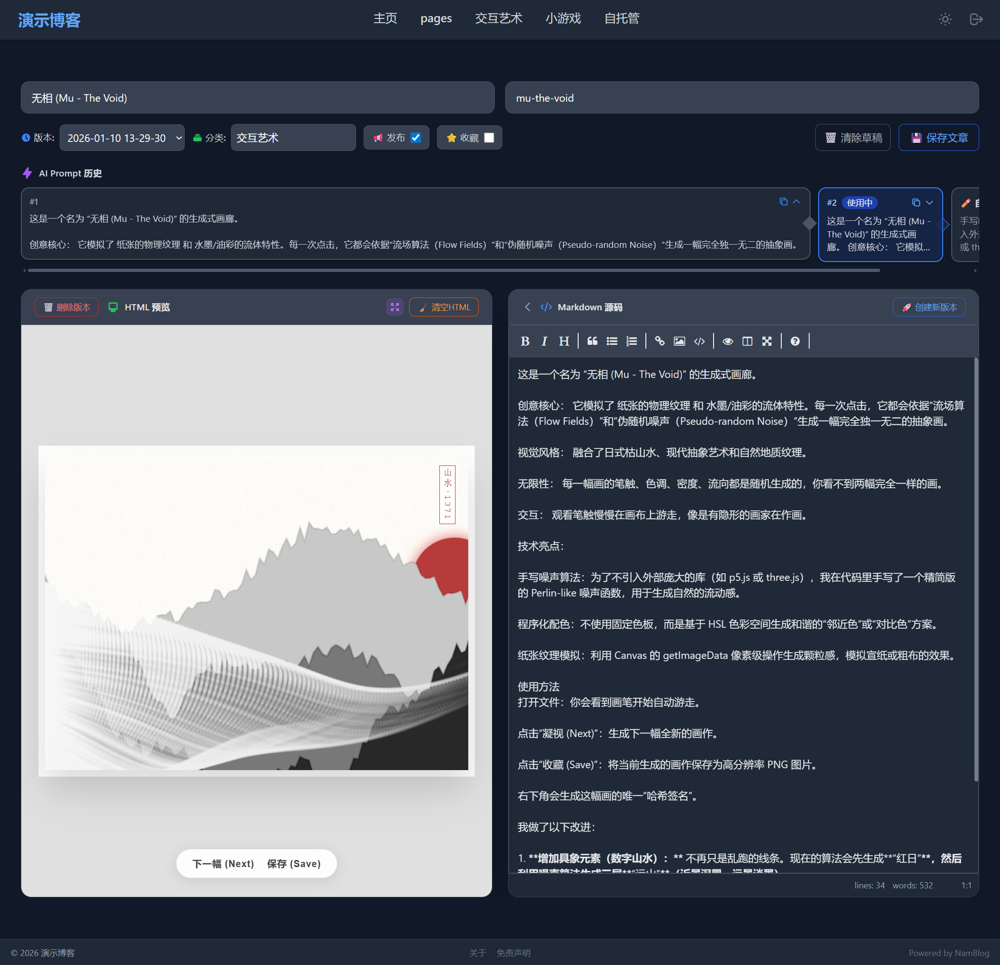

# NamBlog

一个致力于提升内容演示的博客系统。自由的写作，让 AI 生成页面。

[](LICENSE.txt)
[](https://github.com/code-gal/namblog/releases)
[](https://github.com/code-gal/namblog/actions)
[](https://www.docker.com/)
[](https://github.com/code-gal/namblog/pkgs/container/namblog)

## 核心特点

### Markdown + AI = 丰富的网页应用

写博客只需要关注内容本身。把 Markdown 当作蓝图，智能体将其转换为带有样式和交互的 HTML 页面。不仅仅是精美的排版，AI 可以根据你的提示词生成各种各样的网页应用——带动画效果的展示页、交互式图表、代码演示、卡片布局等等。你可以随时切换发布不同版本的页面，尽情发挥你的创意。

### 管理方式

**Web 编辑器**：功能最丰富的编辑方式。支持 AI 预生成和渲染、检查常见 HTML 错误、自动缓存草稿、使用历史提示词、查看版本历史等。适合日常创作和精细化管理。

**MCP 协议**：把博客接入 Cherry Studio 等流行 AI 客户端。你可以在对话中让 AI 帮你自动组织工作流程——创建文章、查询数据、批量修改标签。AI 会自动调用博客的工具完成操作。适合批量管理和自动化操作。

**文件夹监控**：推荐使用 Obsidian 等编辑器创作，将文档库同步到监控目录。保存后自动同步到博客数据库。适合习惯本地写作和知识管理的人。

### 界面预览

<p align="center">
  <a href="Docs-Tools/images/index.png"></a>
  <a href="Docs-Tools/images/page.png"></a>
</p>
<p align="center">
  <a href="Docs-Tools/images/edit(desktop).png"></a>
  <a href="Docs-Tools/images/edit(desktop-dark).png"></a>
</p>

<video width="630" height="300" src="https://github.com/user-attachments/assets/d63d4c97-ea3c-42fb-91f8-79d66395107c" controls></video>

## 主要功能

### 创作

- Markdown 编辑器，支持实时预览
- 提交文章时让 AI 生成 HTML，可以自定义提示词控制风格
- 每次提交创建新版本，完整保留历史记录
- 支持草稿状态，不发布也能预览效果

### 管理

- 文章标题、分类、标签等元数据随时修改
- 版本列表查看和切换，一键发布任意历史版本
- 按分类、标签、发布状态筛选文章
- 支持加锁和精选标记，方便在首页标记特定内容

### 展示

- 响应式布局，手机和电脑都能正常浏览
- 深色模式切换
- 分页浏览文章列表
- 分类和标签页面

### 现代化前端体验

- **PWA 支持**：可安装为桌面应用，支持离线访问
- **SPA 架构**：基于 Vue 3 的单页应用，流畅无刷新浏览
- **SEO 优化**：自动检测搜索引擎爬虫，返回预渲染的静态 HTML，确保内容可被索引

### 部署与扩展

- **网站统计集成**：支持在页脚嵌入第三方统计脚本（如 Umami、Google Analytics）。详见：[网站统计脚本配置说明](Docs-Tools/网站统计脚本配置说明.md)
- **灵活配置**：博客名称、AI 参数、CORS 等配置支持热重载，部分配置可通过环境变量覆盖

## MCP 集成使用

### 什么是 MCP

Model Context Protocol (MCP) 是 AI 工具和应用程序之间的通信协议。通过 MCP，你可以在 Claude Desktop 等 AI 客户端中直接操作博客。

### 配置

**1. 配置 AuthToken**

在 `./data/config/config.json` 中设置认证令牌：

```json
{
  "MCP": {
    "AuthToken": "your-secure-token"
  }
}
```

或通过 Docker 环境变量设置：
```bash
MCP__AuthToken="your-secure-token"
```

**2. 在 MCP 客户端添加 NamBlog 服务器**

NamBlog 支持两种传输方式：

**方式一：StreamableHttp**（推荐）
```json
{
  "mcpServers": {
    "namblog": {
      "url": "https://your_domain/mcp",
      "transport": "streamableHttp",
      "headers": {
        "Authorization": "Bearer your-secure-token"
      }
    }
  }
}
```

**方式二：SSE**
```json
{
  "mcpServers": {
    "namblog": {
      "url": "https://your_domain/mcp/sse",
      "transport": "sse",
      "headers": {
        "Authorization": "Bearer your-secure-token"
      }
    }
  }
}
```

启动 MCP 服务器后，客户端会自动发现可用的工具（Tools）、专用提示（Prompts）和资源（Resources）。

### MCP 支持的功能

**查询操作**：
- 查询文章列表（支持分类、标签、发布状态等筛选）
- 获取文章元数据（标题、分类、标签、版本列表等）
- 获取文章的 Markdown 原文
- 获取指定版本的 HTML 内容
- 查看博客基本信息（博主资料、外链等）

**管理操作**：
- 创建新文章
- 更新文章元数据（标题、分类、标签、摘要）
- 提交新版本（生成 HTML）
- 切换发布状态（发布/取消发布）
- 删除文章或版本

**AI 工具**：
- Markdown 转 HTML（不保存到数据库，用于预览）

**提示词模板**：
- 创建文章指导（告诉 AI 如何组合多个工具完成创建流程）
- 优化文章指导（提供文章质量检查清单）

**资源访问**：
- 读取资源文件（后端静态资源、提示词模板等）


## 快速开始

### 使用 Docker 部署（推荐）

```bash

# 下载 docker-compose.yml
curl -O https://raw.githubusercontent.com/code-gal/NamBlog/main/docker-compose.yml

# 创建配置目录
mkdir -p data/config

# 下载配置模板
curl -o data/config/config.json \
  https://raw.githubusercontent.com/code-gal/NamBlog/main/NamBlog.API/wwwroot/config/config.json.template

# 编辑配置文件（配置 AI API Key 等）
vi data/config/config.json

# 启动服务
docker-compose up -d
```

访问 http://localhost:5000 开始使用。

### Docker 镜像标签说明

| 标签 | 说明 | 适用场景 |
|------|------|---------|
| `stable` | 稳定版本（推荐） | 生产环境 |
| `latest` | 最新版本 | 开发环境 |
| `1` | 主版本号（如 1.x.x） | 测试环境 |
| `0.8.0` | 具体版本号 | 需要锁定版本 |

```bash
# 生产环境推荐
docker pull ghcr.io/code-gal/namblog:stable

# 开发环境
docker pull ghcr.io/code-gal/namblog:latest

# 锁定特定版本
docker pull ghcr.io/code-gal/namblog:0.8.0
```

详细配置参考：[配置模板](NamBlog.API/wwwroot/config/config.json.template) | [配置系统说明](Docs-Tools/配置系统说明.md)

### 本地开发

需要 .NET 10 SDK。

```bash
# 克隆仓库
git clone https://github.com/code-gal/namblog.git
cd namblog

# 启动后端
cd NamBlog.API
# 配置 AI API Key（编辑 appsettings.Development.json）
dotnet run

# 启动前端（新终端）
cd NamBlog.Web
# 使用任意 HTTP 服务器
python -m http.server 8080
```

**开发者文档**: [发布指南](Docs-Tools/NamBlog发布指南.md) | [完整开发文档](Docs-Tools/NamBlog开发指南.md)

**主要技术栈**：.NET + GraphQL + EF Core + Vue 3 + Docker
